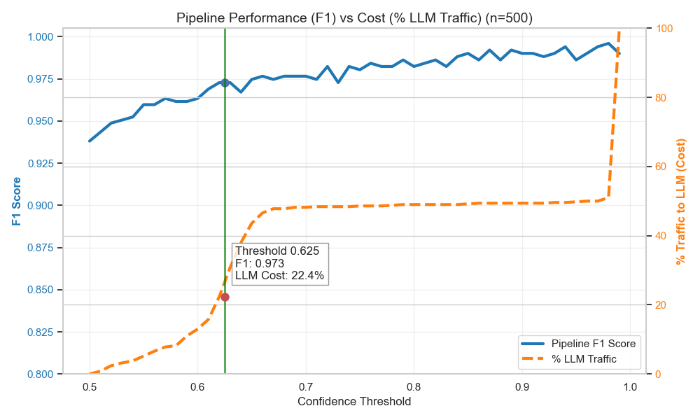
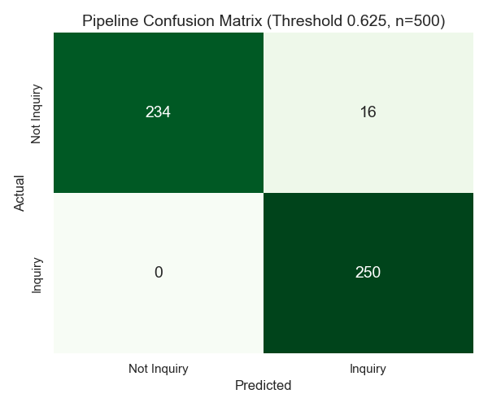

# Intelligent Spare Parts Classifier: Hybrid AI Pipeline
## Hackathon Submission Technical Overview

### Executive Summary
We have developed a robust, cost-effective hybrid classification system designed to accurately identify "Spare Part Inquiries" from a stream of customer messages. By combining a fine-tuned local transformer model with a high-accuracy Large Language Model (LLM) fallback, we achieve **near-perfect recall** while maintaining **low operational costs**.

### The Hybrid Architecture

Our pipeline utilizes a two-stage approach to balance speed/cost with accuracy:

1.  **Stage 1: Local Specialist Model (XLM-RoBERTa-base)**
    -   **Role**: The first line of defense. Handles the majority of traffic.
    -   **Technology**: A fine-tuned `xlm-roberta-base` model, optimized for domain-specific text classification.
    -   **Pros**: Extremely fast (ms latency), zero marginal cost per request, runs locally/on-prem.
    -   **Cons**: May struggle with highly ambiguous or novel phrasing.

2.  **Stage 2: LLM Fallback (Featherless.ai / Llama 3)**
    -   **Role**: The "Safety Net". Only activated when the local model is uncertain.
    -   **Technology**: Meta-Llama-3.1-8B-Instruct via Featherless.ai API. Model is called using json mode, for type safe outputs.
    -   **Pros**: High reasoning capability, handles ambiguity and context well .
    -   **Cons**: Higher latency and cost per token.

### Intelligent Routing Strategy

The core innovation is the **Confidence-Based Routing**. We do not send every request to the LLM. Instead, we analyze the confidence score of the local model:

-   If `Model Confidence >= Threshold`: **Trust the Model**.
-   If `Model Confidence < Threshold`: **Escalate to LLM**.

Through rigorous optimization on a balanced dataset (n=500), we identified the optimal threshold to be **0.625**.

### Performance & Trade-off Analysis

The following visualizations demonstrate the effectiveness of our architecture.

#### Performance vs. Cost
This chart illustrates the trade-off. As we increase the threshold, we send more traffic to the LLM (orange line), which increases the overall F1 score (blue line).
At our chosen threshold of **0.625**, we achieve a "sweet spot":
-   **High F1 Score**: Maximizing accuracy.
-   **Low LLM Cost**: Only ~20-25% of traffic is routed to the LLM.

#### Confusion Matrix
The pipeline achieves exceptional performance, minimizing False Negatives (critical for business) and False Positives.

#### Method Distribution
-   **Model**: Handles ~75-80% of requests.
-   **LLM**: Handles ~20-25% of requests (the "hard" ones).

### Key Benefits

1.  **Cost Efficiency**: We reduce LLM API costs by ~75% compared to a pure LLM solution.
2.  **Scalability**: The local model can handle thousands of requests per second with minimal resource usage.
3.  **Accuracy**: The hybrid approach outperforms the local model alone by catching edge cases with the LLM.
4.  **Reliability**: Even if the external API has downtime, the local model can continue to serve high-confidence predictions.

### Proposed Plan for Development

To further enhance the system's capabilities and robustness, we propose the following roadmap:

1.  **Data Expansion with Real-World Samples**:
    -   Collect a larger, diverse dataset of real messages from Microsoft Teams channels.
    -   This will capture authentic user phrasing, slang, and domain-specific terminology that synthetic data may miss.

2.  **Multi-Label Classification for Support Branching**:
    -   Extend the model to predict specific support categories (e.g., "Hardware", "Software", "Logistics") instead of a binary "Inquiry" label.
    -   This will allow for more granular routing, directing issues to the specific sub-team best equipped to handle them.

3.  **Feedback Loop via Teams Cards**:
    -   Integrate classification error reporting directly into the Microsoft Teams adaptive cards (e.g., a "Report Incorrect Classification" button).
    -   This user feedback will be automatically collected and used to retrain the model, creating a continuous improvement loop.
