# Teams Agent - Channel Message Notifier

This Teams bot listens for messages in channels and sends notification cards to a pre-configured user.

## Features

- Listens for messages in Teams channels
- Sends notification cards to a pre-chosen user when channel messages are received
- **Deep links to original channel messages** - Cards include a "View in Channel" button that opens the message directly in Teams
- **Conditional notifications** - Only sends notifications when conditions are met:
  - Message is not empty
  - Message is not from the bot itself
  - Optional keyword filtering (configurable)
- Stores conversation references for proactive messaging
- Uses Microsoft Agents SDK for Python

## Setup

1. **Install dependencies:**
   ```bash
   pip install -r requirements.txt
   ```

2. **Configure environment variables:**
   - Copy `env.TEMPLATE` to `.env` (or set environment variables)
   - Fill in your Azure AD app registration details:
     - `CONNECTIONS__SERVICE_CONNECTION__SETTINGS__CLIENTID`
     - `CONNECTIONS__SERVICE_CONNECTION__SETTINGS__CLIENTSECRET`
     - `CONNECTIONS__SERVICE_CONNECTION__SETTINGS__TENANTID`
   - Set the target user ID:
     - `TARGET_USER_ID` - The Azure AD Object ID of the user who should receive notification cards

3. **Run the application:**
   ```bash
   python app.py
   ```

   Or using Docker:
   ```bash
   docker build -t teams-agent .
   docker run -p 3978:3978 --env-file .env teams-agent
   ```

## How It Works

1. **Initial Setup:** The target user must send at least one message to the bot (via direct message) to establish a conversation reference. This allows the bot to send proactive messages later.

2. **Channel Monitoring:** When a message is posted in any channel where the bot is present, the bot:
   - Detects it's a channel message
   - **Checks conditions** - Only proceeds if message meets criteria (not empty, not from bot, matches keywords if configured)
   - Extracts the message content and sender information
   - Creates a Teams deep link to the original message
   - Sends a notification card to the pre-configured user
   - Acknowledges the action in the channel

3. **Notification Cards:** The cards include:
   - Title: "Channel Notification"
   - Message: The channel message content and sender name
   - Image: Microsoft branding image
   - **"View in Channel" button**: Deep link that opens the original message directly in Teams

## Architecture & Flow Diagram

The following diagram illustrates the complete flow of the agent, including all functions and their interactions:

```mermaid
flowchart TD
    Start([Application Start]) --> AppPy[app.py]
    AppPy --> MainPy[main.py]
    MainPy -->|Setup Logging| Logger[Configure Microsoft Agents Logger]
    MainPy -->|Create Auth Config| AuthConfig[AgentAuthConfiguration]
    MainPy -->|Call start_server| StartServer[start_server.py]
    
    StartServer -->|Create HTTP App| HTTPApp[Create aiohttp Application]
    HTTPApp -->|Add Middleware| JWTMiddleware[jwt_authorization_middleware]
    HTTPApp -->|Add Routes| Routes[API Messages Route POST GET]
    HTTPApp -->|Store References| StoreRefs[Store AGENT_APP and adapter]
    HTTPApp -->|Start Server| RunServer[run_app on localhost port 3978]
    
    RunServer -->|Listen| Listen[Server Listening]
    
    Listen -->|HTTP Request| EntryPoint[entry_point function]
    EntryPoint -->|Process Request| StartAgent[start_agent_process]
    StartAgent -->|Route to Handler| AgentApp[AGENT_APP from agent.py]
    
    AgentApp -->|Message Activity| OnMessage[on_message handler]
    AgentApp -->|Members Added| OnMembersAdded[on_members_added handler]
    AgentApp -->|Error| OnError[on_error handler]
    
    OnMessage -->|Extract User ID| GetUserId[Extract user_id from activity]
    GetUserId -->|Store Reference| GetConvRef[get_conversation_reference]
    GetConvRef -->|Save| StoreConvRef[Store in conversation_references dict]
    
    OnMessage -->|Check Type| IsChannel{Is Channel Message?}
    
    IsChannel -->|Yes| ShouldNotify[should_send_notification]
    IsChannel -->|No| DirectMessage[Direct Message Handler]
    
    ShouldNotify -->|Check 1| CheckEmpty{Message Empty?}
    CheckEmpty -->|Yes| Skip[Skip - Return]
    CheckEmpty -->|No| CheckBot{From Bot?}
    CheckBot -->|Yes| Skip
    CheckBot -->|No| CheckKeywords{Keywords Configured?}
    CheckKeywords -->|Yes| MatchKeywords{Message Contains Keyword?}
    MatchKeywords -->|No| Skip
    MatchKeywords -->|Yes| Proceed[Proceed with Notification]
    CheckKeywords -->|No| Proceed
    
    Proceed -->|Extract Info| ExtractInfo[Extract message_text & sender_name]
    ExtractInfo -->|Create Deep Link| CreateDeepLink[CardMessages.create_teams_deep_link]
    
    CreateDeepLink -->|Extract Channel Data| ExtractChannel[Extract channel_id, team_id, message_id]
    ExtractChannel -->|Build URL| BuildURL[Build Teams deep link URL]
    BuildURL -->|Return| DeepLinkURL[Return deep_link or None]
    
    DeepLinkURL -->|Check Target User| CheckTarget{TARGET_USER_ID Set?}
    CheckTarget -->|No| SendWarning[Send warning to channel]
    CheckTarget -->|Yes| SendCard[send_card_to_user]
    
    SendCard -->|Get Reference| GetStoredRef[Get conversation_ref from dict]
    GetStoredRef -->|Check Exists| RefExists{Reference Exists?}
    RefExists -->|No| SendError[Print warning & return False]
    RefExists -->|Yes| ContinueConv[adapter.continue_conversation]
    
    ContinueConv -->|Callback| SendNotificationCard[CardMessages.send_notification_card]
    SendNotificationCard -->|Create Buttons| CreateButtons[Create CardAction buttons]
    CreateButtons -->|Add Deep Link| AddDeepLink{Deep Link Available?}
    AddDeepLink -->|Yes| ViewButton[Add 'View in Channel' button]
    AddDeepLink -->|No| FallbackButton[Add 'Learn More' fallback button]
    ViewButton -->|Build Card| BuildCard[CardFactory.hero_card]
    FallbackButton -->|Build Card| BuildCard
    
    BuildCard -->|Create HeroCard| HeroCard[HeroCard with title, text, image, buttons]
    HeroCard -->|Send| SendActivity[CardMessages.send_activity]
    SendActivity -->|Create Activity| CreateActivity[Activity with Attachment]
    CreateActivity -->|Send| ContextSend[context.send_activity]
    
    ContextSend -->|Return Success| Success[Return True]
    Success -->|Acknowledge| AckChannel[Send acknowledgment to channel]
    
    DirectMessage -->|Check User| IsTarget{Is Target User?}
    IsTarget -->|Yes| WelcomeTarget[Send welcome message to target user]
    IsTarget -->|No| InfoMessage[Send info message to other user]
    
    OnMembersAdded -->|Welcome| WelcomeMsg[Send welcome message]
    
    OnError -->|Log Error| LogError[Print error to stderr]
    LogError -->|Send Error| SendErrorMsg[Send error message to user]
    
    style Start fill:#e1f5ff
    style OnMessage fill:#fff4e1
    style SendCard fill:#e8f5e9
    style SendNotificationCard fill:#e8f5e9
    style Skip fill:#ffebee
    style Error fill:#ffebee
```



### Function Reference

#### `agent.py`
- **`get_conversation_reference(activity)`** - Extracts conversation reference from activity for proactive messaging
- **`should_send_notification(activity)`** - Checks if notification should be sent based on conditions (empty check, bot check, keyword filtering)
- **`send_card_to_user(adapter, user_id, message_text, channel_deep_link, sender_name)`** - Sends a notification card to a specific user using stored conversation reference
- **`on_message(context, state)`** - Main message handler that processes incoming messages, detects channel messages, and triggers notifications
- **`on_members_added(context, state)`** - Handler for when bot is added to a conversation (sends welcome message)
- **`on_error(context, error)`** - Error handler that logs errors and sends error messages

#### `card_messages.py`
- **`create_teams_deep_link(activity)`** - Creates a Teams deep link URL to the channel message using channel/team/message IDs
- **`send_notification_card(context, message_text, channel_deep_link, sender_name)`** - Creates and sends a notification card with hero card format
- **`send_activity(context, card)`** - Helper function to send an activity with card attachment

#### `main.py`
- **`main()`** - Application entry point that sets up logging, creates auth configuration, and starts the server

#### `start_server.py`
- **`start_server(agent_application, auth_configuration)`** - Sets up HTTP server with aiohttp, adds routes and middleware, and starts listening

## Project Structure

```
.
├── src/
│   ├── __init__.py
│   ├── agent.py          # Main agent logic
│   ├── card_messages.py  # Card creation and sending
│   ├── main.py          # Application entry point
│   └── start_server.py   # HTTP server setup
├── app.py               # Root entry point
├── requirements.txt     # Python dependencies
├── env.TEMPLATE        # Environment variable template
├── DOCKERFILE          # Docker configuration
└── README.md           # This file
```

## Configuration

### Required Environment Variables

- `CONNECTIONS__SERVICE_CONNECTION__SETTINGS__CLIENTID` - Azure AD App Client ID
- `CONNECTIONS__SERVICE_CONNECTION__SETTINGS__CLIENTSECRET` - Azure AD App Client Secret
- `CONNECTIONS__SERVICE_CONNECTION__SETTINGS__TENANTID` - Azure AD Tenant ID
- `TARGET_USER_ID` - Azure AD Object ID of the user to receive notifications

### Optional Environment Variables

- `PORT` - Server port (default: 3978)
- `TARGET_USER_TENANT_ID` - Tenant ID for target user (usually same as TENANTID)
- `BOT_ID` - Bot ID (usually auto-detected)
- `SERVICE_URL` - Service URL (usually auto-detected)
- `NOTIFICATION_KEYWORDS` - Comma-separated list of keywords. Only messages containing at least one keyword will trigger notifications. Leave empty to send notifications for all messages.
  - Example: `NOTIFICATION_KEYWORDS=urgent,important,help`
  - Example: `NOTIFICATION_KEYWORDS=` (empty = send all messages)

## Notification Conditions

The bot only sends notifications when all of the following conditions are met:

1. **Message is not empty** - Empty messages are ignored
2. **Message is not from the bot** - Prevents notification loops
3. **Keyword filtering (optional)** - If `NOTIFICATION_KEYWORDS` is configured, the message must contain at least one of the specified keywords (case-insensitive)

## Notes

- The bot stores conversation references in memory. In production, consider using persistent storage (CosmosDB, Blob Storage) for conversation references.
- The target user must interact with the bot at least once (send a direct message) before they can receive proactive notifications.
- Channel messages are detected by checking `channel_data` or `conversation_type`.
- Deep links to channel messages require proper channel and team IDs from the activity. If these cannot be extracted, the card will include a fallback button instead.

## Troubleshooting

- **"No conversation reference found"**: The target user needs to send a direct message to the bot first.
- **"TARGET_USER_ID not configured"**: Make sure you've set the `TARGET_USER_ID` environment variable.
- **Authentication errors**: Verify your Azure AD app registration credentials are correct.

