# Teams Agent - Channel Message Notifier

This Teams bot listens for messages in channels and sends notification cards to a pre-configured user.

## Features

- Listens for messages in Teams channels
- Sends notification cards to a pre-chosen user when channel messages are received
- **Deep links to original channel messages** - Cards include a "View in Channel" button that opens the message directly in Teams
- **Conditional notifications** - Only sends notifications when conditions are met:
  - Message is not empty
  - Message is not from the bot itself
  - Optional keyword filtering (configurable)
- Stores conversation references for proactive messaging
- Built with **FastAPI** for a simple, modern web framework
- Uses **Pydantic models** based on Microsoft Teams MessageActionsPayload structure

## Setup

1. **Install dependencies:**
   ```bash
   pip install -r requirements.txt
   ```

2. **Configure environment variables:**
   - Copy `env.TEMPLATE` to `.env` (or set environment variables)
   - Set the target user ID:
     - `TARGET_USER_ID` - The Azure AD Object ID of the user who should receive notification cards
   - Optional: Configure notification keywords:
     - `NOTIFICATION_KEYWORDS` - Comma-separated list of keywords (e.g., `urgent,important,help`)

3. **Run the application:**
   ```bash
   python app.py
   ```
   
   Or using uvicorn directly:
   ```bash
   uvicorn src.main:app --host 0.0.0.0 --port 3978
   ```

   Or using Docker:
   ```bash
   docker build -t teams-agent .
   docker run -p 3978:3978 --env-file .env teams-agent
   ```

## How It Works

1. **Initial Setup:** The target user must send at least one message to the bot (via direct message) to establish a conversation reference. This allows the bot to send proactive messages later.

2. **Channel Monitoring:** When a message is posted in any channel where the bot is present, the bot:
   - Receives the message via the `/api/messages` webhook endpoint
   - Parses the payload using Pydantic models (MessageActionsPayload)
   - Detects it's a channel message
   - **Checks conditions** - Only proceeds if message meets criteria (not empty, not from bot, matches keywords if configured)
   - Extracts the message content and sender information
   - Creates a Teams deep link to the original message
   - Sends a notification card to the pre-configured user
   - Returns a response acknowledging the action

3. **Notification Cards:** The cards include:
   - Title: "Channel Notification"
   - Message: The channel message content and sender name
   - Image: Microsoft branding image
   - **"View in Channel" button**: Deep link that opens the original message directly in Teams

## Architecture & Flow Diagram

The following diagram illustrates the complete flow of the agent using FastAPI:

```mermaid
flowchart TD
    Start([Application Start]) --> AppPy[app.py]
    AppPy --> MainPy[main.py]
    MainPy -->|Import app| StartServer[start_server.py - FastAPI App]
    
    StartServer -->|Create FastAPI App| FastAPIApp[FastAPI Application]
    FastAPIApp -->|Add Middleware| CORSMiddleware[CORS Middleware]
    FastAPIApp -->|Add Exception Handler| ExceptionHandler[Global Exception Handler]
    FastAPIApp -->|Add Routes| Routes[/api/messages POST/GET<br/>/health<br/>/]
    FastAPIApp -->|Start Server| UvicornServer[Uvicorn Server on 0.0.0.0:3978]
    
    UvicornServer -->|Listen| Listen[Server Listening]
    
    Listen -->|HTTP POST Request| MessagesEndpoint[messages_endpoint function]
    MessagesEndpoint -->|Parse JSON| ParseBody[Parse request body]
    ParseBody -->|Handle Formats| HandleFormats{Payload Format?}
    
    HandleFormats -->|value field| ExtractValue[Extract from value]
    HandleFormats -->|message field| ExtractMessage[Extract from message]
    HandleFormats -->|Activity object| ExtractActivity[Extract Activity fields]
    HandleFormats -->|Root level| UseRoot[Use root payload]
    
    ExtractValue --> ParsePayload[Parse as MessageActionsPayload]
    ExtractMessage --> ParsePayload
    ExtractActivity --> ParsePayload
    UseRoot --> ParsePayload
    
    ParsePayload -->|Validate| PydanticModel[Pydantic Model Validation]
    PydanticModel -->|Process| ProcessMessage[process_message function]
    
    ProcessMessage -->|Store Reference| StoreConvRef[store_conversation_reference]
    StoreConvRef -->|Save| ConversationRefs[Store in conversation_references dict]
    
    ProcessMessage -->|Check Type| IsChannel{Is Channel Message?}
    
    IsChannel -->|Yes| ShouldNotify[should_send_notification]
    IsChannel -->|No| DirectMessage[Direct Message Handler]
    
    ShouldNotify -->|Check 1| CheckEmpty{Message Empty?}
    CheckEmpty -->|Yes| Skip[Skip - Return Acknowledgment]
    CheckEmpty -->|No| CheckBot{From Bot?}
    CheckBot -->|Yes| Skip
    CheckBot -->|No| CheckKeywords{Keywords Configured?}
    CheckKeywords -->|Yes| MatchKeywords{Message Contains Keyword?}
    MatchKeywords -->|No| Skip
    MatchKeywords -->|Yes| Proceed[Proceed with Notification]
    CheckKeywords -->|No| Proceed
    
    Proceed -->|Extract Info| ExtractInfo[Extract message_text & sender_name]
    ExtractInfo -->|Create Deep Link| CreateDeepLink[CardMessages.create_teams_deep_link]
    
    CreateDeepLink -->|Extract Channel Data| ExtractChannel[Extract channel_id, team_id, message_id]
    ExtractChannel -->|Build URL| BuildURL[Build Teams deep link URL]
    BuildURL -->|Return| DeepLinkURL[Return deep_link or None]
    
    DeepLinkURL -->|Check Target User| CheckTarget{TARGET_USER_ID Set?}
    CheckTarget -->|No| ResponseWarning[Return warning in response]
    CheckTarget -->|Yes| ResponseSuccess[Return success message in response]
    
    ResponseWarning -->|Format Response| FormatResponse[Format as Activity object]
    ResponseSuccess -->|Format Response| FormatResponse
    
    FormatResponse -->|Return JSON| JSONResponse[JSONResponse with Activity]
    JSONResponse -->|HTTP 200| ReturnToTeams[Return to Teams]
    
    DirectMessage -->|Check User| IsTarget{Is Target User?}
    IsTarget -->|Yes| WelcomeTarget[Return welcome message]
    IsTarget -->|No| InfoMessage[Return info message]
    
    WelcomeTarget -->|Format Response| FormatResponse
    InfoMessage -->|Format Response| FormatResponse
    
    Skip -->|Format Response| FormatResponse
    
    ExceptionHandler -->|Catch Errors| LogError[Log error to stderr]
    LogError -->|Return Error| ErrorResponse[Return HTTP 500 with error details]
    
    style Start fill:#e1f5ff
    style ProcessMessage fill:#fff4e1
    style ShouldNotify fill:#e8f5e9
    style CreateDeepLink fill:#e8f5e9
    style Skip fill:#ffebee
    style ErrorResponse fill:#ffebee
    style FastAPIApp fill:#4a90e2,color:#fff
    style PydanticModel fill:#4a90e2,color:#fff
```



### Function Reference

#### `agent.py`
- **`should_send_notification(payload)`** - Checks if notification should be sent based on conditions (empty check, bot check, keyword filtering)
- **`get_message_text(payload)`** - Extracts message text from MessageActionsPayload
- **`get_sender_name(payload)`** - Extracts sender name from MessageActionsPayload
- **`is_channel_message(payload)`** - Detects if message is from a channel (not a direct message)
- **`store_conversation_reference(payload)`** - Stores conversation reference for proactive messaging
- **`process_message(payload)`** - Main message processing function that handles channel messages and direct messages, returns Activity response

#### `card_messages.py`
- **`create_teams_deep_link(payload)`** - Creates a Teams deep link URL to the channel message using channel/team/message IDs from MessageActionsPayload
- **`create_notification_card(message_text, channel_deep_link, sender_name)`** - Creates a notification card JSON structure with hero card format

#### `start_server.py`
- **`app`** - FastAPI application instance
- **`messages_endpoint(request)`** - POST endpoint handler for `/api/messages` that processes Teams webhook payloads
- **`messages_get()`** - GET endpoint for health checks
- **`global_exception_handler(request, exc)`** - Global exception handler for error logging and response formatting

#### `models.py`
- **`MessageActionsPayload`** - Main Pydantic model for Teams message payload
- **`MessageActionsPayloadFrom`** - Model for sender information (user, application, conversation)
- **`MessageActionsPayloadBody`** - Model for message body content
- **`MessageActionsPayloadAttachment`** - Model for message attachments
- **`MessageActionsPayloadMention`** - Model for message mentions
- **`MessageActionsPayloadReaction`** - Model for message reactions
- Additional nested models: `MessageActionsPayloadUser`, `MessageActionsPayloadApp`, `MessageActionsPayloadConversation`

#### `main.py`
- **`app`** - FastAPI app instance imported from start_server
- Server startup configuration with uvicorn

## Project Structure

```
.
├── src/
│   ├── __init__.py
│   ├── agent.py          # Main agent logic and message processing
│   ├── card_messages.py  # Card creation and deep link generation
│   ├── models.py        # Pydantic models for MessageActionsPayload
│   ├── main.py         # Application entry point (uvicorn config)
│   └── start_server.py  # FastAPI application setup and routes
├── tests/
│   └── test_integration.py  # Integration tests
├── app.py               # Root entry point
├── requirements.txt     # Python dependencies
├── env.TEMPLATE        # Environment variable template
├── pytest.ini          # Pytest configuration
├── DOCKERFILE          # Docker configuration
└── README.md           # This file
```

## Configuration

### Required Environment Variables

- `TARGET_USER_ID` - Azure AD Object ID of the user to receive notifications

### Optional Environment Variables

- `PORT` - Server port (default: 3978)
- `HOST` - Server host (default: 0.0.0.0)
- `NOTIFICATION_KEYWORDS` - Comma-separated list of keywords. Only messages containing at least one keyword will trigger notifications. Leave empty to send notifications for all messages.
  - Example: `NOTIFICATION_KEYWORDS=urgent,important,help`
  - Example: `NOTIFICATION_KEYWORDS=` (empty = send all messages)
- `DISABLE_AUTH` - Set to "true" to enable detailed error messages in responses (for development/testing)

## API Endpoints

### POST `/api/messages`
Main webhook endpoint for receiving messages from Teams.

**Request:** Teams webhook payload (MessageActionsPayload format or Activity object)

**Response:** Activity object with message response

**Supported Payload Formats:**
- MessageActionsPayload at root level
- Wrapped in `value` field
- Wrapped in `message` field
- Full Activity object (automatically converted to MessageActionsPayload)

### GET `/api/messages`
Health check endpoint.

**Response:** `{"status": "ok"}`

### GET `/`
Root endpoint.

**Response:** `{"status": "ok", "service": "Teams Agent"}`

### GET `/health`
Health check endpoint.

**Response:** `{"status": "healthy"}`

## Notification Conditions

The bot only sends notifications when all of the following conditions are met:

1. **Message is not empty** - Empty messages are ignored
2. **Message is not from the bot** - Prevents notification loops
3. **Keyword filtering (optional)** - If `NOTIFICATION_KEYWORDS` is configured, the message must contain at least one of the specified keywords (case-insensitive)

## Technology Stack

- **FastAPI** - Modern, fast web framework for building APIs
- **Pydantic** - Data validation using Python type annotations
- **Uvicorn** - ASGI server for running FastAPI
- **Python-dotenv** - Environment variable management

## Notes

- The bot stores conversation references in memory. In production, consider using persistent storage (CosmosDB, Blob Storage) for conversation references.
- The target user must interact with the bot at least once (send a direct message) before they can receive proactive notifications.
- Channel messages are detected by checking the `conversation_identity_type` in the payload.
- Deep links to channel messages require proper channel and team IDs from the payload. If these cannot be extracted, the card will include a fallback button instead.
- The implementation uses Pydantic models based on Microsoft's MessageActionsPayload structure, ensuring compatibility with Teams webhook payloads.

## Troubleshooting

- **"No conversation reference found"**: The target user needs to send a direct message to the bot first.
- **"TARGET_USER_ID not configured"**: Make sure you've set the `TARGET_USER_ID` environment variable.
- **Validation errors**: Check that the incoming payload matches the MessageActionsPayload structure. The models allow extra fields, so minor variations should be handled gracefully.
- **500 errors**: Check server logs for detailed error messages. If `DISABLE_AUTH=true`, error details will be included in the response.
